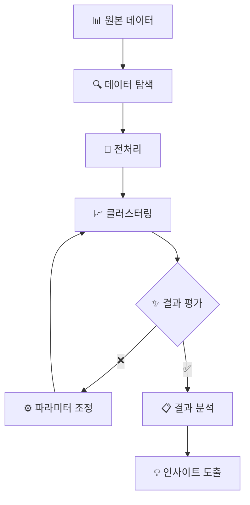

# 📊 데이터 전처리 및 클러스터링 기법 가이드

## 🎯 데이터 클러스터링이란?
- 비슷한 특성을 가진 데이터들을 그룹으로 묶는 작업
- 예) 고객 구매 패턴 기반 그룹화

## 🧹 데이터 전처리의 중요성
- 깨끗한 데이터 → 정확한 분석 결과
- 실제 데이터는 정제 필요 (누락값, 이상값 처리)

### 💫 전처리 단계별 가이드

#### 1️⃣ 불필요한 열 제거
- 분석 무관 데이터 삭제
- 예) 고객 분석시 주문번호 제외

#### 2️⃣ 데이터 인코딩
- 컴퓨터 이해 가능한 형태로 변환
- 예) 성별: 남성=0, 여성=1

#### 3️⃣ 데이터 스케일링
- 단위 차이 조정 (나이 vs 소득)
- 특성간 균형 유지

> **💡 스케일링 방법 비교**
> | 방법 | 설명 | 적용 케이스 |
> |:---:|:---:|:---:|
> | 표준화 | 평균=0, 표준편차=1 | 정규분포 데이터 |
> | 정규화 | 0~1 범위 조정 | 이상치 적은 경우 |

## 🔍 클러스터링 기법 상세 가이드

### 자주 묻는 질문 (FAQ)
1. **최적의 클러스터링 방법은?**
   - 데이터 특성/목적 기반 선택
   - 아래 비교표 참고

2. **클러스터 수 결정 방법은?**
   - 시각적 판단
   - 수학적 최적화

> **🎯 클러스터링 방법 비교**
> | 방법 | 특징 | 장점 | 단점 |
> |:---:|:---:|:---:|:---:|
> | K-Means | 원형 그룹화 | 빠르고 직관적 | 비원형 취약 |
> | 계층적 | 트리 구조화 | 시각화 우수 | 대용량 취약 |
> | DBSCAN | 밀도 기반 | 유연한 형태 | 파라미터 복잡 |
> | GMM | 확률 기반 | 높은 유연성 | 계산 복잡 |

### 🎯 최적 그룹 수 찾기

1. **엘보우 방법**
   - 그래프 굴절점 확인
   - 예) 3개 지점 굴절 → 3그룹 최적

2. **실루엣 분석**
   - 그룹 구분도 점수화
   - 1에 가까울수록 최적

# 📊 클러스터링 결과 분석

## 📈 그룹 특성 파악
- 평균값 비교 분석
- 패턴 시각화

## 🎯 차원 축소 기법
- 데이터 단순화
- PCA 특성 추출

> **💡 PCA 이해하기**
> 
> - **PCA1**: 주요 특성 축
>   예) 키+몸무게 → '체격'
> 
> - **PCA2**: 보조 특성 축
>   예) 체형 분류

# 🚀 실전: 예측 모델 구축

## 📊 모델 개발 단계
1. 데이터 분할 (학습/테스트)
2. 모델 비교 분석
3. 최적 모델 선정

## 📈 성능 평가 지표
- **정확도**: 예측 성공률
- **ROC-AUC**: 불균형 데이터 평가

> **📊 평가 지표 가이드**
> 
> 1. **정확도**
>    - ✅ 직관적 이해 용이
>    - ❌ 불균형 데이터 취약
> 
> 2. **ROC-AUC**
>    - ✅ 높은 신뢰도
>    - ❌ 해석 복잡