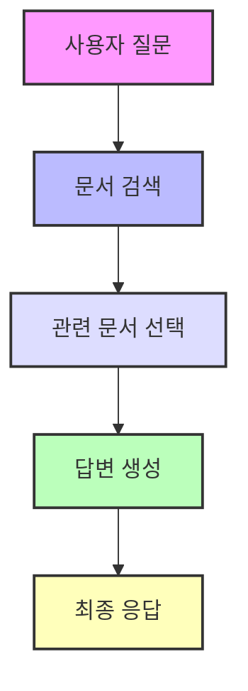

# RAG: 더 똑똑한 AI 언어 모델 만들기

RAG(Retrieval-Augmented Generation)는 AI 언어 모델이 외부 자료를 찾아보면서 대화할 수 있게 만드는 새로운 방법이에요. 마치 사람이 질문에 답할 때 책이나 인터넷을 찾아보는 것처럼요!

## 기존 AI 모델의 문제점

지금까지의 AI 모델들은 이런 한계가 있었어요:
- 한번 학습하면 새로운 정보를 추가하기 어려워요 (전체를 다시 학습해야 해요)
- 왜 그런 대답을 했는지 설명하기 어려워요
- 가끔 사실이 아닌 내용을 만들어내기도 해요

## RAG는 어떻게 다른가요?

RAG는 두 가지 방식을 합쳐서 사용해요:
1. 기본 지식 (파라메트릭 메모리)
   - BART라는 AI 모델이 기본적인 언어 이해와 생성을 담당해요
2. 검색 기능 (비파라메트릭 메모리)
   - 위키피디아 같은 외부 자료를 찾아볼 수 있어요

## RAG는 이렇게 작동해요

1. 사용자가 질문을 하면
2. 관련된 문서들을 찾아보고
3. 찾은 정보를 바탕으로 답변을 만들어내요

## RAG의 두 가지 버전

- **RAG-Sequence**: 하나의 문서를 참고해서 답변 전체를 만들어요
- **RAG-Token**: 답변의 각 부분마다 다른 문서들을 참고할 수 있어요

## 실험으로 알아본 RAG의 성능

### 1. 다양한 테스트
- 질문-답변 테스트
  - 일반적인 지식을 묻는 질문들로 정확도 측정
  - 예: "태양계에서 가장 큰 행성은?"
- 글쓰기 테스트
  - 주어진 주제로 얼마나 자연스러운 글을 쓸 수 있는지 평가
- 사실 확인 테스트
  - 주어진 정보가 사실인지 판단하는 능력 측정

### 2. 다른 모델들과 비교
- 책만 보고 답하는 모델 (Closed-Book)
  - 미리 학습한 내용만 사용
- 자료를 찾아보는 모델 (Open-Book)
  - 필요한 정보를 찾아보며 답변

### 3. 평가 방법
- 정확도: 답이 얼마나 정확한지
- 글의 품질: 얼마나 자연스럽게 글을 쓰는지
- 사실 검증: 얼마나 정확하게 사실을 판단하는지

### Open-Domain QA 성능

| 모델 | Natural Questions | TriviaQA | WebQuestions | CuratedTrec |
|------|------------------|-----------|--------------|-------------|
| Closed-Book (T5) | 34.5 | 50.1 | 37.4 | - |
| REALM | 40.4 | - | 40.7 | 46.8 |
| DPR | 41.5 | 57.9 | 41.1 | 50.6 |
| **RAG-Sequence** | **44.5** | **68.0** | **45.2** | **52.2** |
| **RAG-Token** | **44.1** | **66.1** | **45.5** | **50.0** |

### 생성 작업 (MS-MARCO, Jeopardy)
- MS-MARCO에서 RAG-Sequence가 BART보다 BLEU 점수 2.6점 향상
- Jeopardy에서 RAG 모델은 더욱 구체적이고 정확한 질문 생성

### 사실 검증 (FEVER)
- 3-way 분류 정확도에서 기존 모델 대비 4.3% 차이로 근접한 성능

## 실험 결과와 의미

1. **하이브리드 접근법의 유용성**:
   - RAG는 파라메트릭 메모리와 비파라메트릭 메모리를 결합하여 두 접근법의 장점을 극대화
   - 검색된 외부 지식을 적극 활용하므로 기존 모델보다 정확하고 신뢰성 높은 결과 생성

2. **정보 업데이트 가능성**:
   - 비파라메트릭 메모리(Wikipedia)를 교체함으로써 **모델 재훈련 없이도 최신 지식 반영 가능**
   - 이는 빠르게 변화하는 도메인(예: 정치, 경제)에서 매우 유용

3. **다양한 응용 가능성**:
   - QA, 생성 작업, 사실 검증 등 **다양한 지식 중심 작업**에 적합
   - 단순한 답변 생성 외에도, 복잡한 추론 및 자연어 처리 작업에 적용 가능