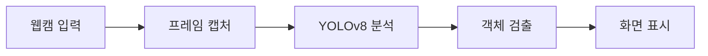
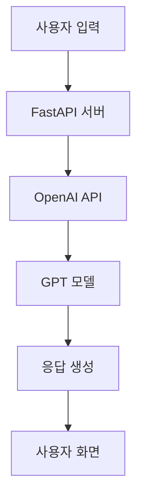

# 오늘의 코드 실습 정리 📝

## 1. 실시간 객체 탐지 프로그램 구현하기 🎥
### 사용 기술: PyQt5 + YOLOv8

#### 1️⃣ YOLOv8 모델 설정
```python
self.model = YOLO('yolov8x.pt')
```
- YOLOv8은 최신 객체 탐지 AI 모델
- 실시간으로 물체를 인식하고 분류 가능

#### 2️⃣ UI 구성 요소
```python
# 기본 요소 설정
self.image_label = QLabel(self)
self.start_button = QPushButton("웹캠 시작", self)
self.stop_button = QPushButton("웹캠 정지", self)

# 레이아웃 설정
self.layout.addWidget(self.image_label)
self.layout.addWidget(self.start_button)
self.layout.addWidget(self.stop_button)
```

#### 3️⃣ 웹캠 제어 기능
```python
# 웹캠 시작
self.capture = cv2.VideoCapture(0)  # 카메라 연결
self.timer.start(20)                # 50fps로 설정

# 실시간 프레임 처리
ret, frame = self.capture.read()    # 프레임 읽기
results = self.model(frame)         # AI 모델로 분석
img_with_boxes = result.plot()      # 결과 시각화
```

## 2. AI 챗봇 만들기 🤖
### 사용 기술: FastAPI + OpenAI API

#### 1️⃣ 서버 설정
```python
app = FastAPI()
templates = Jinja2Templates(directory="templates")
app.mount("/static", StaticFiles(directory="static"), name="static")
```

#### 2️⃣ OpenAI 연동
```python
openai.api_key = "YOUR_API_KEY"
```

#### 3️⃣ 주요 기능
- **GET 요청**: 채팅 페이지 표시
- **POST 요청**: AI 응답 처리
- **대화 관리**: 문맥 유지를 위한 대화 기록 관리

## 시각화 자료 📊

### YOLOv8 동작 과정


### 챗봇 시스템 구조


## 참고 자료 📚
1. [YOLOv8 공식 문서](https://docs.ultralytics.com/)
2. [FastAPI 튜토리얼](https://fastapi.tiangolo.com/ko/)
3. [OpenAI API 가이드](https://platform.openai.com/docs/guides/overview)

## 실습 TIP 💡
- YOLOv8 모델은 처음 로딩 시 시간이 걸릴 수 있습니다
- 웹캠 해상도는 성능에 큰 영향을 미치므로 적절히 조절하세요
- API 키는 반드시 안전하게 관리해야 합니다