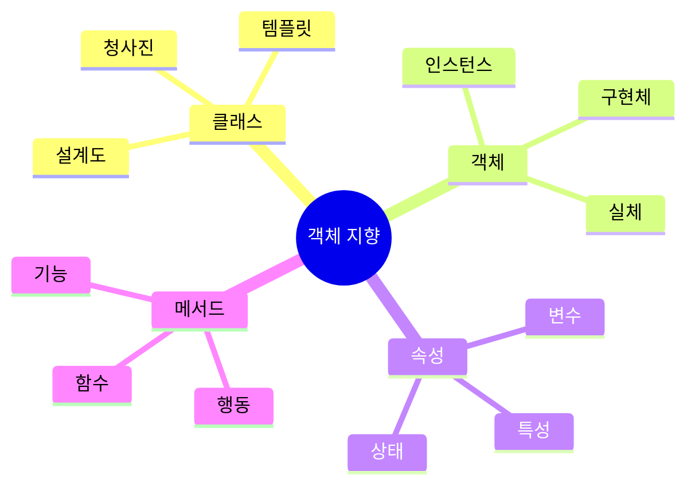

## 파이썬 객체 지향 프로그래밍 학습 노트 📚

### 1. 기본 개념 이해하기 🎯

- 클래스와 객체의 관계
    - 클래스는 마치 케이크 틀처럼 객체를 만들기 위한 템플릿입니다
    - 객체는 케이크 틀로 만든 실제 케이크와 같이, 클래스로 만든 실제 결과물입니다

### 2. 핵심 용어 정리 📝

# 클래스 용어 정리

| 용어 | 설명 |
| --- | --- |
| 클래스 | 제품의 설계도 |
| 객체 | 설계도로 만든 제품 |
| 속성 | 클래스 안의 변수 |
| 메서드 | 클래스 안의 함수 |
| 생성자 | 객체를 만들 때 실행되는 함수 |
| 인스턴스 | 메모리에 살아있는 객체 |



### 3. 실전 예제: Monster 클래스 🐉

```python
class Monster:
    def __init__(self, name, type):
        self.name = name    # 몬스터의 이름
        self.type = type    # 몬스터의 종류
    
    def introduce(self):
        return f"나는 {self.type}인 {self.name}입니다!"

# 객체 생성 예시
shark = Monster("샤키", "상어")
wolf = Monster("울피", "늑대")
```

### 44. 단계별 학습 가이드 📈

- 기초 단계
    - 클래스와 객체의 개념 이해하기
        
        ```python
        # 기본적인 클래스 예시
        class Car:
            def __init__(self, model):
                self.model = model
        
        my_car = Car("Tesla")  # 객체 생성
        ```
        
    - 생성자(`__init__`) 사용법 익히기
        
        ```python
        # 다양한 생성자 활용
        class Student:
            def __init__(self, name, age, grade=1):
                self.name = name
                self.age = age
                self.grade = grade
        
        student1 = Student("Alice", 15)      # 기본값 사용
        student2 = Student("Bob", 16, 2)     # 모든 값 지정
        ```
        
- 중급 단계
    - 메서드 정의와 `self` 사용법 마스터하기
        
        ```python
        class BankAccount:
            def __init__(self, balance):
                self.balance = balance
            
            def deposit(self, amount):
                self.balance += amount
                return f"입금 완료: 현재 잔액 {self.balance}원"
            
            def withdraw(self, amount):
                if self.balance >= amount:
                    self.balance -= amount
                    return f"출금 완료: 현재 잔액 {self.balance}원"
                return "잔액 부족"
        ```
        
    - 속성 관리와 접근 방법 학습하기
        
        ```python
        class Person:
            def __init__(self):
                self._private = "비공개"    # 관례상 비공개
                self.__really_private = "진짜 비공개"  # 이름 맹글링
                
            @property  # 프로퍼티 데코레이터 사용
            def private(self):
                return self._private
        ```
        
- 고급 단계
    - 다양한 객체 생성과 관리 방법 익히기
        
        ```mermaid
        classDiagram
            class GameCharacter {
                +String name
                +int level
                +attack()
                +defend()
            }
            class Warrior {
                +int strength
                +specialAttack()
            }
            class Mage {
                +int magic
                +castSpell()
            }
            GameCharacter <|-- Warrior
            GameCharacter <|-- Mage
        ```
        
    - 객체 간의 상호작용 구현하기
        
        ```python
        class Team:
            def __init__(self):
                self.members = []
            
            def add_member(self, player):
                self.members.append(player)
                
            def team_attack(self, target):
                total_damage = sum(member.attack() for member in self.members)
                return f"팀 공격력: {total_damage}"
        ```
        

### 5. 해볼방법 💡

<aside>
중요한 포인트:
- IDE에서 직접 코드를 작성하며 실습하기
- 다양한 예제를 만들어보며 개념 이해하기
- 에러가 발생하면 디버깅하며 학습하기

</aside>