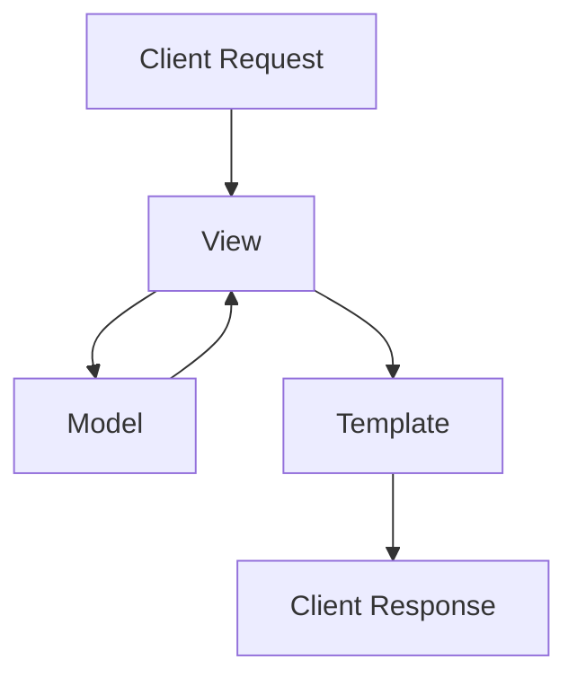

## SQL 코드카타 학습

### 1. 네비게이션 옵션이 있는 차량 조회

```sql
SELECT CAR_ID,CAR_TYPE,DAILY_FEE,OPTIONS
from CAR_RENTAL_COMPANY_CAR
where options like '%네비게이션%'
order by car_id desc
```

### 2. CASE문을 활용한 상품 상태 표시

```sql
SELECT BOARD_ID,WRITER_ID,TITLE,PRICE,
CASE WHEN STATUS='sale' THEN '판매중'
WHEN STATUS='reserved' then '예약중'
else '거래완료'end AS STATUS
FROM USED_GOODS_BOARD
where created_date = '2022-10-05'
order by board_id desc
```

### 3. 조인을 활용한 예약 정보 조회

```sql
SELECT a.APNT_NO, p.PT_NAME,p.PT_NO,d.MCDP_CD,d.DR_NAME,a.APNT_YMD
from appointment a
join doctor d on a.MDDR_ID = d.DR_ID
join patient p on a.PT_NO = p.PT_NO
where a.APNT_YMD like '2022-04-13%' 
and a.APNT_CNCL_YN = 'N' 
and d.MCDP_CD = 'CS'
order by a.APNT_YMD
```

### 4. CASE문을 활용한 대여 상태 확인

```sql
SELECT CAR_ID,
case
when max('2022-10-16' between start_date and end_date)=1 
then '대여중' else '대여 가능'
end as AVAILABILITY
from CAR_RENTAL_COMPANY_RENTAL_HISTORY
group by car_id
order by car_id desc
```

<aside>

**🔑 주요 학습 포인트**

- CASE 문의 다양한 활용 방법 학습
- JOIN을 통한 테이블 연결 실습
- 날짜 데이터 처리 방법 학습
</aside>

---

## Django 프레임워크 구조

<aside>

**📁 주요 파일 구조**

[`admin.py`](http://admin.py) - 관리자용 페이지 관련 설정

[`apps.py`](http://apps.py) - 앱 관련 정보 설정

[`models.py`](http://models.py) - DB관련 데이터 정의 파일

[`tests.py`](http://tests.py) - 테스트 관련 파일

[`views.py`](http://views.py) - 요청을 처리하고 처리한 결과를 반환하는 파일

</aside>

### **Django 디자인 패턴 (MTV)**



### MVC vs MTV 비교

| MVC | MTV | 역할 |
| --- | --- | --- |
| Model | Model | 데이터 관리 |
| View | Template | 화면 표시 |
| Controller | View | 로직 처리 |

<aside>

**💡 MTV 패턴의 장점**

- 관심사 분리를 통한 코드 구조화
- 개발 생산성 향상 및 유지보수 용이
- 팀 협업 효율성 증가
</aside>

### **각 컴포넌트 상세 설명**

- **Model**
    - 데이터베이스 스키마 정의
    - 데이터 처리 및 관리
- **Template**
    - 사용자 인터페이스 구현
    - 동적 HTML 생성
- **View**
    - HTTP 요청 처리
    - 비즈니스 로직 구현
    - Model과 Template 연동