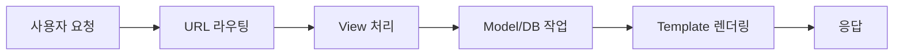

# Django CRUD 기능 정리

Django의 CRUD는 데이터를 다루는 4가지 기본 작업을 의미합니다:

<aside>
• Create (생성) - 새로운 데이터 추가
• Read (읽기) - 데이터 조회 
• Update (수정) - 기존 데이터 변경
• Delete (삭제) - 데이터 제거

</aside>

## 데이터 흐름도



## 1. Create (데이터 생성)

새로운 데이터를 생성하고 저장하는 과정입니다.

<aside>
핵심 단계:
1. 사용자가 Form 제출
2. View에서 데이터 검증
3. DB에 저장

</aside>

```python
# views.py
def create_post(request):
    if request.method == "POST":
        form = PostForm(request.POST)
        if form.is_valid():
            form.save()
            return redirect('post_list')
    else:
        form = PostForm()
    return render(request, 'create_post.html', {'form': form})
```

## 2. Read (데이터 조회)

저장된 데이터를 조회하는 과정입니다.

<aside>
조회 방법:
• 전체 조회: Model.objects.all()
• 특정 조회: Model.objects.get(id=1)
• 필터링: Model.objects.filter(조건)

</aside>

```python
# views.py
def post_list(request):
    posts = Post.objects.all()
    return render(request, 'post_list.html', {'posts': posts})
```

## 3. Update (데이터 수정)

기존 데이터를 수정하는 과정입니다.

<aside>
수정 과정:
1. 기존 데이터 조회
2. Form에 데이터 표시
3. 수정된 데이터 검증
4. DB 업데이트

</aside>

```python
# views.py
def update_post(request, pk):
    post = get_object_or_404(Post, pk=pk)
    if request.method == "POST":
        form = PostForm(request.POST, instance=post)
        if form.is_valid():
            form.save()
            return redirect('post_list')
    else:
        form = PostForm(instance=post)
    return render(request, 'update_post.html', {'form': form})
```

## 4. Delete (데이터 삭제)

데이터를 삭제하는 과정입니다.

<aside>
삭제 과정:
1. 삭제할 데이터 확인
2. 삭제 권한 확인
3. DB에서 제거

</aside>

```python
# views.py
def delete_post(request, pk):
    post = get_object_or_404(Post, pk=pk)
    if request.method == "POST":
        post.delete()
        return redirect('post_list')
    return render(request, 'delete_post.html', {'post': post})
```

## URL 설정

| 경로 | 기능 | 메소드 |
| --- | --- | --- |
| /posts/ | 목록 조회 | GET |
| /posts/new/ | 생성 | GET/POST |
| /posts/<id>/edit/ | 수정 | GET/POST |
| /posts/<id>/delete/ | 삭제 | POST |

💡 주의사항:
• POST 요청에는 항상 CSRF 토큰을 포함해야 합니다
• 데이터 수정/삭제 전 권한 확인이 필요합니다
• 대량의 데이터 처리 시 성능 최적화를 고려해야 합니다