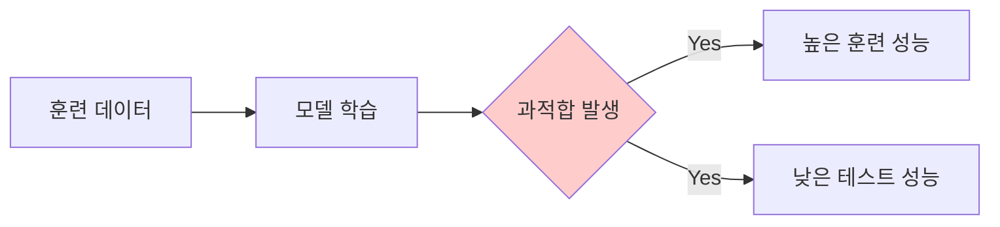

# 머신러닝 과적합 (Overfitting)

**과적합**은 머신러닝 모델이 **훈련 데이터**에 지나치게 최적화된 현상으로 
특정 데이터셋의 세부적인 패턴까지 학습하게 되어,

새로운 데이터(테스트 데이터 또는 실제 환경의 실전 데이터)에 적용했을 때는

기대했던 것보다 현저히 낮은 성능을 보이는 문제 현상을 의미합니다.

이해하기 쉽게 설명하자면, 모델이 마치 시험 문제의 답을 **훈련 데이터를 통째로 암기해버린 것처럼**

실제 상황에서 마주치는 새로운 문제들(일반화된 상황)에 대해서는 효과적으로 대처하지 못하는 상태라고 할 수 있습니다.



## 과적합의 특징

1. **훈련 데이터 성능이 매우 높음**:
    - 훈련 데이터에서는 정확도(Accuracy)나 R² 점수가 거의 완벽에 가까울 정도로 매우 높게 나타나는 특징을 보입니다.
2. **테스트 데이터 성능이 낮음**:
    - 훈련 데이터에서 과도하게 학습한 세부적인 패턴들이 테스트 데이터의 일반적인 특성과 맞지 않아 성능이 현저하게 저하되는 현상이 발생합니다.
3. **복잡한 모델에서 발생하기 쉬움**:
    - 필요 이상으로 많은 특성(Feature)을 사용하거나, 지나치게 깊은 레벨의 의사결정 트리, 또는 과도하게 많은 뉴런을 포함한 신경망 구조를 사용할 때 과적합 현상이 빈번하게 발생합니다.

<aside>
📊 시각적 예시: 과적합 vs 적절한 학습

| 과적합 모델 | 적절한 모델 |
| --- | --- |
| 훈련 데이터의 노이즈까지 완벽하게 학습하여 맞춤 | 데이터의 본질적인 패턴만을 효과적으로 학습 |
| 불필요하게 복잡하고 구불구불한 결정 경계 | 간결하고 명확한 결정 경계 |
| 새로운 데이터에 대한 예측력이 매우 취약 | 새로운 데이터에도 안정적인 예측 수행 |
</aside>

## 과적합 확인 방법

1. 훈련 데이터와 테스트 데이터의 성능 격차를 정량적으로 분석하고 비교
2. 학습 과정에서의 성능 변화를 보여주는 학습 곡선(Learning Curve) 시각화 및 분석

## 과적합을 평가하는 기준

1. **훈련 데이터와 테스트 데이터 성능 차이**:
    - 두 데이터셋 간의 성능 격차가 클수록 심각한 과적합이 발생했을 가능성이 높다고 판단할 수 있습니다.
2. **교차 검증(Cross-Validation) 결과**:
    - 여러 다양한 데이터 분할(Folds)에서 모델이 일관되고 안정적인 성능을 보이는지 세밀하게 검증하고 평가합니다.
3. **복잡한 모델 구조**:
    - 모델의 구조가 필요 이상으로 복잡할 때(예: 과도하게 깊은 의사결정 트리 구조, 불필요하게 많은 수의 뉴런을 포함한 신경망)는 과적합이 발생할 가능성이 매우 높아집니다.

## 과적합을 수정하는 방법

1. 더 많은 데이터 확보: 충분한 양의 훈련 데이터를 수집하여 모델이 더 다양한 패턴과 특성을 학습할 수 있도록 합니다.
2. 모델 단순화: 모델의 복잡도를 낮추고 파라미터 수를 줄여 불필요한 세부 패턴 학습을 방지합니다.
3. 정규화/규제 사용: L1, L2 정규화와 같은 기법을 적용하여 모델의 가중치를 제한하고 과도한 학습을 억제합니다.
4. 교차 검증(Cross-Validation): 데이터를 여러 부분으로 나누어 검증하면서 모델의 일반화 성능을 평가하고 개선합니다.

---

# Django URL Namespace

Django의 URL Namespace는 URL 이름 공간을 지정하여 **앱별로 URL 이름 충돌을 방지하고 관리**하는 기능입니다. 프로젝트가 커질수록 여러 앱과 복잡한 URL 구조를 다뤄야 하므로, URL Namespace를 적절히 활용하면 유지보수성과 가독성을 크게 향상시킬 수 있습니다.

---

## 1. **URL Namespace란 무엇인가?**

URL Namespace는 URL 패턴에 이름을 붙이는 `name` 속성과 함께 사용됩니다. 이를 통해 같은 이름의 URL을 다른 앱이나 다른 영역에서 중복 사용하더라도 충돌을 방지할 수 있습니다.

### 예시: 중복된 URL 이름 문제

- 앱 `blog`와 `shop`에 각각 `detail`이라는 이름의 URL이 있다고 가정:
    - `/blog/1/` → `blog` 앱의 `detail`
    - `/shop/1/` → `shop` 앱의 `detail`
- `name='detail'`만 사용하면 Django는 어느 `detail`을 호출해야 할지 알 수 없으므로 에러가 발생.

Namespace를 사용하면 이를 해결할 수 있습니다:

- `blog:detail`
- `shop:detail`

---

## 2. **Namespace 사용 방법**

### 2.1 URLconf에서 Namespace 정의

1. **앱별 URL 설정**: 각 앱의 `urls.py` 파일에서 URL을 정의.
2. **프로젝트 수준에서 include 사용**: `include`를 통해 네임스페이스를 연결.

### 앱 `blog`의 `urls.py`

```python
from django.urls import path
from . import views

app_name = 'blog'  # Namespace 정의
urlpatterns = [
    path('<int:pk>/', views.detail, name='detail'),  # URL 이름: blog:detail
    path('', views.post_list, name='list'),         # URL 이름: blog:list
]

```

### 프로젝트 `urls.py`

```python
from django.urls import path, include

urlpatterns = [
    path('blog/', include('blog.urls')),  # blog 앱의 URL 네임스페이스 연결
    path('shop/', include('shop.urls')),  # shop 앱의 URL 네임스페이스 연결
]

```

---

### 2.2 템플릿에서 Namespace 사용

템플릿에서 `namespace:name` 형식으로 URL을 지정합니다.

### 템플릿 예시

```html
<a href="">블로그 상세 보기</a>
<a href="">쇼핑몰 상품 보기</a>

```

---

### 2.3 뷰에서 Namespace 사용

Django의 `reverse()` 또는 `redirect()` 함수에서도 동일하게 사용합니다.

### 예시

```python
from django.shortcuts import redirect, reverse

def redirect_to_blog_detail(request, pk):
    # blog:detail URL로 리다이렉트
    return redirect(reverse('blog:detail', args=[pk]))

```

---

## 3. **Namespace의 유용한 상황**

### 3.1 복잡한 프로젝트 구조

- 대규모 프로젝트에서 앱이 많아질수록 URL 이름이 중복될 가능성이 커짐.
- 각 앱에 고유한 네임스페이스를 부여하면 충돌을 방지하고 URL을 명확히 구분 가능.

### 3.2 동일한 뷰 이름 사용

- 서로 다른 앱에서 같은 이름의 뷰(예: `list`, `detail`, `create`)를 사용하는 경우.

### 3.3 다중 앱 통합 관리

- 한 프로젝트에 여러 앱이 있지만, URL 이름이 섞이지 않도록 유지.

### 3.4 특정 네임스페이스에서 공통 기능 제공

- 예: 관리자 페이지 URL에 네임스페이스를 적용하여 분리.
    
    ```python
    path('admin/', include('admin.urls', namespace='admin')),
    
    ```
    

---

## 4. **Namespace 활용 팁**

### 4.1 **Nested Namespace**

네임스페이스를 중첩하여 더 세부적인 이름 공간을 설정할 수 있습니다.

### 예시: `blog` 앱의 `comments` 네임스페이스

```python
# blog.urls.py
from django.urls import path, include

app_name = 'blog'
urlpatterns = [
    path('', include('blog.comments.urls', namespace='comments')),  # blog:comments:detail
]

```

```python
# blog/comments/urls.py
app_name = 'comments'
urlpatterns = [
    path('<int:pk>/', views.comment_detail, name='detail'),  # URL 이름: blog:comments:detail
]

```

템플릿 사용:

```html
<a href="">댓글 상세 보기</a>

```

---

### 4.2 **동적 네임스페이스**

`reverse()`를 사용할 때 네임스페이스를 동적으로 결정해야 하는 경우 유용합니다.

### 예시: 다중 네임스페이스를 사용하는 URL 리다이렉트

```python
def redirect_to_namespace_detail(request, namespace, pk):
    # namespace:detail 형식의 URL로 리다이렉트
    return redirect(reverse(f'{namespace}:detail', args=[pk]))

```

---

### 4.3 **다중 사이트 지원**

프로젝트에서 여러 사이트를 운영할 경우, 각 사이트에 네임스페이스를 부여하여 URL 이름을 구분.

```python
# 프로젝트 urls.py
urlpatterns = [
    path('site1/', include('blog.urls', namespace='site1_blog')),
    path('site2/', include('blog.urls', namespace='site2_blog')),
]

```

---

## 5. **Namespace 사용 시 주의점**

1. **`app_name` 선언 필수**: `urls.py`에서 `app_name`을 정의하지 않으면 네임스페이스가 작동하지 않음.
2. **일관성 유지**: 프로젝트 전반에서 네임스페이스와 URL 이름 규칙을 통일하여 관리.
3. **중첩 네임스페이스의 복잡성**: 네임스페이스를 너무 깊게 중첩하면 가독성이 떨어질 수 있으므로 필요할 때만 사용.