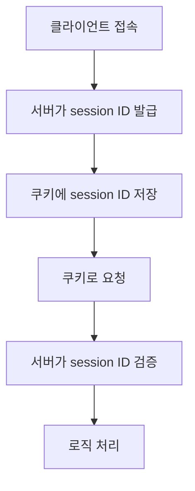

오늘진행한 코드카타

```python
# Python
최댓값과 최솟값
def solution(s):
    s=list(map(int,s.split()))
    result=f'{min(s)} {max(s)}'
    return result

정수 제곱근 판별
def solution(n):
    answer = 0
    if (n**(1/2)).is_integer():
        answer = (n**(1/2)+1)**2
    else: 
        answer = -1
    return answer
    
import math
def solution(n):
    answer = 0
    if math.sqrt(n).is_integer():
        answer = (n**(1/2)+1)**2
    else: 
        answer = -1
    return answer
    
두 개 뽑아서 더하기
def solution(numbers):
    answer = set()
    for i, n in enumerate(numbers):
        for j, num in enumerate(numbers):
            if i != j:
                answer.add(n + num)
    return sorted(answer)
```

# Django Authentication & Sessions 핵심 정리

## 1. Auth (인증) 시스템

Django의 인증 시스템은 두 가지 핵심 요소로 구성됩니다:

- 인증(Authentication): 사용자 신원 확인
- 권한(Authorization): 사용자 접근 권한 관리

## 2. HTTP와 상태 관리

<aside>
HTTP 프로토콜의 특징

- 비연결지향(Connectionless): 요청-응답 후 연결 종료
- 무상태(Stateless): 이전 요청을 기억하지 않음
</aside>

## 3. 쿠키와 세션의 작동 방식



### 쿠키 🍪

<aside>

클라이언트 측에 저장되는 작은 데이터 조각

- 장바구니, 로그인 상태 유지 등에 활용
- Key-Value 형태로 저장
</aside>

### 세션

<aside>

서버 측에서 관리하는 사용자 상태 정보

- 보안이 중요한 데이터 저장
- 세션 ID만으로 사용자 인증
</aside>

## 4. Django에서의 구현

| 기능 | 구현 방법 |
| --- | --- |
| 로그인 | login() 함수로 세션 생성 |
| 로그아웃 | logout() 함수로 세션 삭제 |
| 접근 제한 | @login_required 데코레이터 사용 |

### Django의 주요 인증 도구

<aside>
Authentication Form: 기본 로그인 폼 제공

- User 모델: 사용자 정보 관리
- Decorators: 접근 제어 (@login_required 등)
</aside>

추가 학습 자료:

- [Django 공식 문서 - Authentication System](https://docs.djangoproject.com/en/stable/topics/auth/)
- [MDN - HTTP 쿠키](https://developer.mozilla.org/ko/docs/Web/HTTP/Cookies)