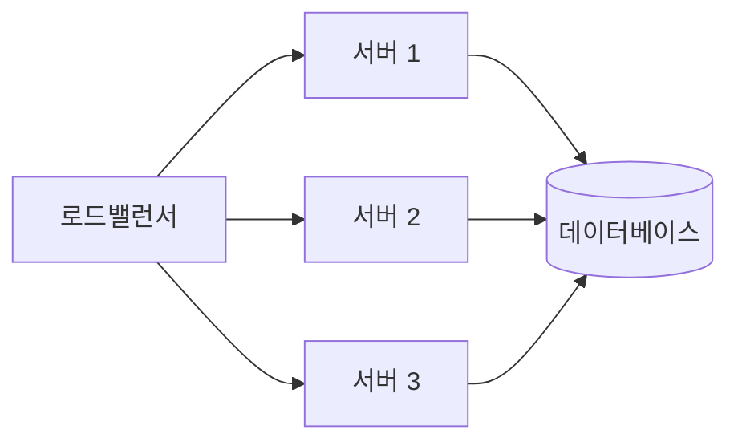
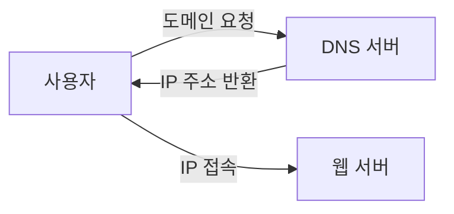

# 웹 서비스 핵심 개념 정리

## REST 아키텍처
- REST(Representational State Transfer)는 웹 서비스의 핵심 아키텍처
- 자원의 상태를 직관적으로 표현하는 방식
  - GET: 정보 조회
  - POST: 정보 전송
  - PUT: 정보 수정/업데이트
  - DELETE: 정보 삭제
- RESTful: 이름만으로 행동을 유추할 수 있는 직관적 구현 방식

### REST API 예시
```
GET /users           # 사용자 목록 조회
GET /users/123       # 특정 사용자 조회
POST /users          # 새 사용자 생성
PUT /users/123       # 사용자 정보 수정
DELETE /users/123    # 사용자 삭제
```

## API & RESTful API
### API
- 서비스 사용을 위한 소프트웨어 인터페이스
- 함수/클래스 단위 구현 가능

### RESTful API
- REST 원칙을 따르는 API
- 주요 메서드: GET, POST, PUT, DELETE

## 시스템 아키텍처
### 클러스터링
- 여러 컴퓨터가 하나의 시스템처럼 동작
- 목적: 시스템 신뢰성 확보
- 사용자 입장: 단일 시스템처럼 보임



### 병렬컴퓨팅
- 하나의 큰 문제를 여러 컴퓨터가 분산 처리
- 예시: 슈퍼컴퓨터의 기상예측
- 클러스터링과의 차이
  - 동일 시스템 사용 불필요
  - 단일 문제 해결에 초점

## 통신 프로토콜
### 기본 개념
- Protocol: 통신 규약/형식
- HTTP: 웹상의 정보 교환 프로토콜
- HTTPS: 암호화된 보안 HTTP
- HTML: 웹 페이지 구조화 언어

### 브라우저
- 웹사이트 표시 프로그램
- 예시: 크롬, 웨일즈, 엣지, 사파리, 익스플로러

### 네트워크 프로토콜
#### UDP vs TCP 비교표
| 특성 | UDP | TCP |
|------|-----|-----|
| 연결 방식 | 비연결형 | 연결형 |
| 속도 | 빠름 | 상대적 느림 |
| 신뢰성 | 낮음 | 높음 |
| 데이터 순서 | 보장안됨 | 보장됨 |
| 사용예시 | 실시간 스트리밍 | 웹브라우징, 이메일 |

### 네트워크 주소 체계
- IP: 호스트 주소 지정/패킷 관리 프로토콜
- Domain: 호스트의 이름 (예: naver.com)
- DNS: IP주소와 도메인 이름 변환 시스템



## Serialization (직렬화)
- 정의: 객체/데이터 구조의 포맷 변환
- 목적: 저장/전송 용이성
- 특징
  - 데이터 구조 유지
  - 재구성 가능한 포맷 변환
- 활용
  - Python/Django 객체 → JSON, XML, YAML
  - Django의 내장 직렬화 기능 제공

### 직렬화 예시
```python
# Python 객체
user = {
    "name": "John",
    "age": 30,
    "email": "john@example.com"
}

# JSON으로 직렬화
json_data = json.dumps(user)
# {"name": "John", "age": 30, "email": "john@example.com"}
```