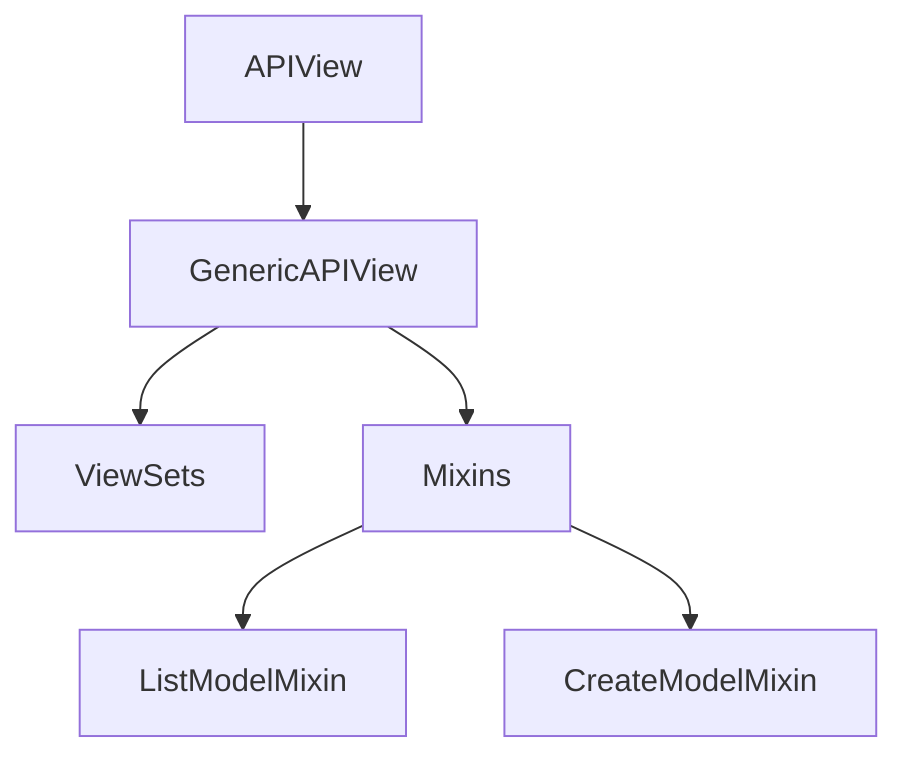

## Class Based View (CBV) 개요

<aside>
클래스 기반 뷰(CBV)는 Django에서 뷰를 구현하는 현대적인 방식으로, 코드를 더 체계적이고 재사용 가능하게 만듭니다.

</aside>

### Class Based View 주요 특징

- HTTP 메소드별 처리 분리
    - GET 요청 → `get()` 메소드에서 처리
    - POST 요청 → `post()` 메소드에서 처리
- 코드의 재사용성과 유지보수성 향상
- 다양한 내장 CBV 제공 (`APIView` 기반)

### Class Based View 종류



- `APIView`
    - DRF CBV의 기본 클래스
    - HTTP 메소드 핸들링의 기초 제공
- `GenericAPIView`
    - 일반적인 API 개발에 필요한 기본 기능 포함
    - CRUD 작업을 위한 내장 기능 제공
- `Mixin`
    - 재사용 가능한 기능들을 모듈화한 클래스
    - 주요 Mixin 클래스:
        - `ListModelMixin` - 목록 조회
        - `CreateModelMixin` - 객체 생성
- `ViewSets`
    - 여러 엔드포인트를 단일 클래스로 관리
    - RESTful API 구현 간소화

### 실제 구현 예시

<aside>
**ArticleListAPIView 구현**

```python
from rest_framework.views import APIView

class ArticleListAPIView(APIView):
    def get(self, request):
        articles = Article.objects.all()
        serializer = ArticleSerializer(articles, many=True)
        return Response(serializer.data)

    def post(self, request):
        serializer = ArticleSerializer(data=request.data)
        if serializer.is_valid(raise_exception=True):
            serializer.save()
            return Response(serializer.data, status=status.HTTP_201_CREATED)
```

</aside>

<aside>
**URLs 설정**

```python
from django.urls import path
from . import views

app_name = "articles"
urlpatterns = [
    path("", views.ArticleListAPIView.as_view(), name="article_list"),
    path("<int:pk>/", views.ArticleDetailAPIView.as_view(), name="article_detail"),
]
```

</aside>

<aside>
**💡 CBV vs FBV 사용 가이드**

- CBV와 FBV는 상황에 따라 선택적 사용
- CBV: 복잡한 CRUD 작업, 재사용성이 필요한 경우
- FBV: 간단한 로직, 커스텀 로직이 많은 경우
</aside>