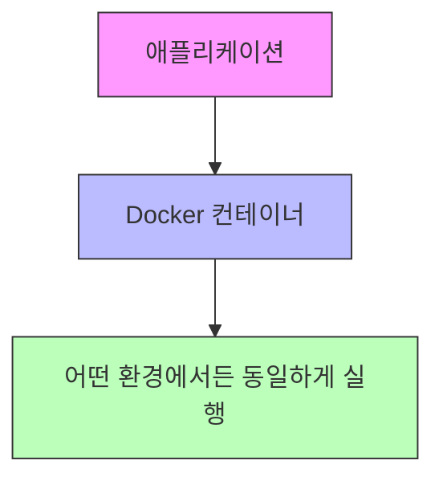
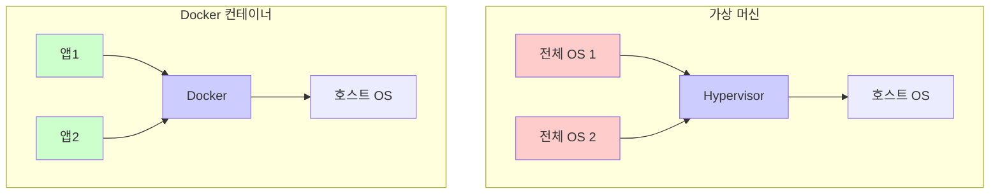
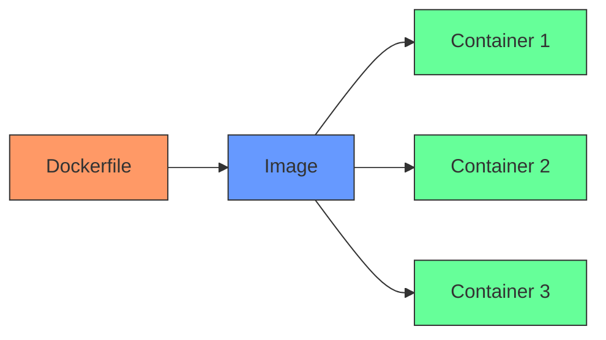

# **Docker 완벽 가이드: 컨테이너화의 시작**

## **1. Docker란?**

Docker는 애플리케이션을 쉽고 빠르게 배포할 수 있게 해주는 플랫폼입니다. 마치 실제 물류 시스템에서 표준화된 컨테이너를 사용하는 것처럼, Docker도 소프트웨어를 표준화된 단위('컨테이너')로 패키징합니다.



### **Docker의 핵심 장점**

<aside>
**🚀 가벼움**: 필요한 것만 담아 빠르게 실행
**🔄 이식성**: "내 컴퓨터에서는 작동했는데..." 문제 해결
**⚡ 빠른 배포**: 개발부터 배포까지 일관된 환경

</aside>

### **컨테이너 vs 가상 머신: 차이점 이해하기**

🏠 **가상 머신은 집 전체를 새로 짓는 것**과 같습니다:

- 각각의 가상 머신은 완전한 운영체제를 포함
- 많은 자원이 필요하고 시작이 느림

🏗️ **컨테이너는 아파트의 각 방**과 같습니다:

- 건물의 기초(호스트 OS)를 공유
- 각 방(컨테이너)은 독립적이지만 자원을 효율적으로 사용

| **비교 포인트** | **가상 머신** | **컨테이너** |
| --- | --- | --- |
| 시작 속도 | 수 분 | 수 초 |
| 자원 사용 | 많음 (완전한 OS) | 적음 (필요한 것만) |
| 격리 수준 | 완벽한 격리 | 프로세스 수준 격리 |
| 용량 | GB 단위 | MB 단위 |



## **2. Docker의 핵심 구성 요소**

<aside>
Docker를 이해하기 위한 3가지 핵심 개념:
1. **Dockerfile**: 이미지를 만들기 위한 설계도
2. **이미지**: 애플리케이션과 환경을 담은 패키지
3. **컨테이너**: 실제로 실행되는 애플리케이션 인스턴스

</aside>

### **Dockerfile 작성 가이드**

Dockerfile은 마치 요리 레시피와 같습니다. 단계별로 필요한 재료(의존성)를 추가하고, 환경을 설정하며, 최종적으로 애플리케이션을 실행하는 방법을 정의합니다.

```
# 기본 이미지 선택 (Python 3.10 경량 버전)
FROM python:3.10-slim

# 작업 디렉토리 설정
WORKDIR /app

# 의존성 파일 복사 및 설치
COPY requirements.txt /app/
RUN pip install --no-cache-dir -r requirements.txt

# 애플리케이션 코드 복사
COPY . /app

# 실행 명령어 설정
CMD ["python", "app.py"]
```

**💡 각 명령어 설명:**

- **FROM**: 기본 이미지 선택 (예: Python, Node.js, Java 등)
- **WORKDIR**: 작업 디렉토리 설정 (컨테이너 내부의 현재 위치)
- **COPY**: 로컬 파일을 컨테이너로 복사
- **RUN**: 이미지 빌드 중 실행할 명령어
- **CMD**: 컨테이너 실행 시 실행할 명령어

