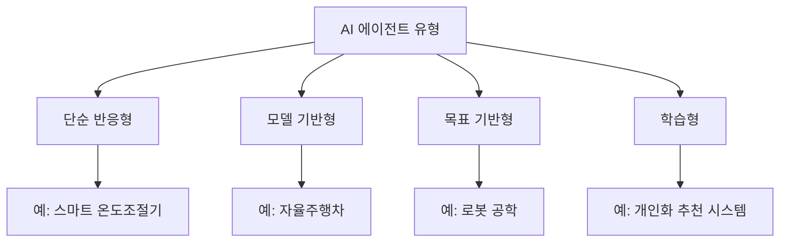
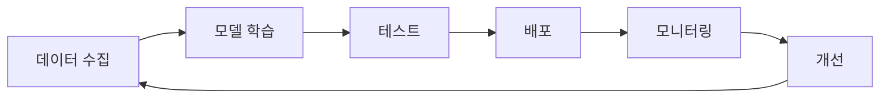
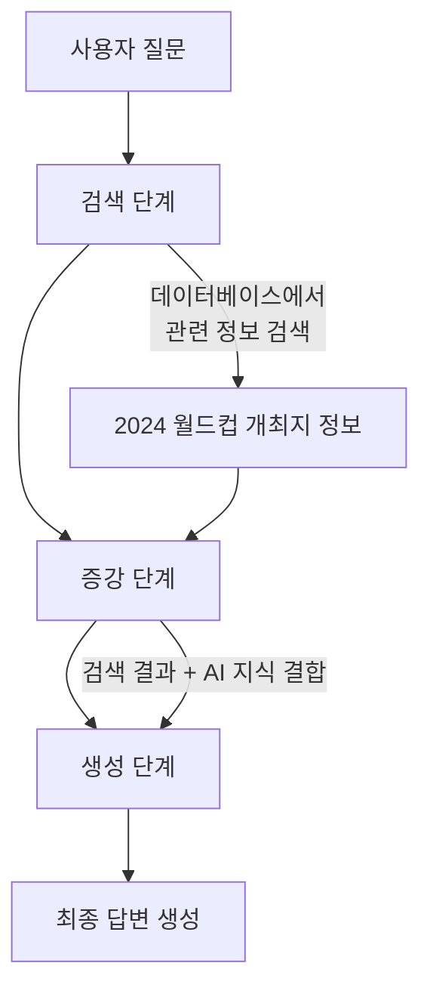

## AI 에이전트란?

AI 에이전트는 마치 똑똑한 비서처럼 우리를 돕는 소프트웨어예요. 주변 상황을 파악하고, 주어진 목표를 달성하기 위해 스스로 판단하고 행동하죠.

<aside>
💡 실생활 예시: 스마트홈의 AI 비서
- 음성 명령 인식: "거실 온도 24도로 맞춰줘"
- 상황 파악: 현재 온도 확인
- 작업 실행: 에어컨 조절

</aside>

## AI 에이전트의 3가지 핵심 능력

- 👀 환경 감지: 센서나 인터페이스로 정보 수집 (예: 자율주행차의 카메라)
- 🧠 데이터 분석: 수집한 정보를 바탕으로 최선의 선택 예측
- 🎯 자율적 실행: 스스로 판단하여 행동

## AI 에이전트의 장점

<aside>
✨ 주요 이점
- 24시간 끊김 없는 서비스
- 일관된 품질의 작업 수행
- 빠른 데이터 처리와 의사결정
- 개인화된 서비스 제공

</aside>

## AI 에이전트의 종류

## AI 에이전트 개발 과정

| 단계 | 주요 내용 | 예시 |
| --- | --- | --- |
| 1. 목적 정의 | 명확한 목표 설정 | 고객 서비스 챗봇 개발 |
| 2. 데이터 준비 | 학습 데이터 수집 | 과거 상담 기록 분석 |
| 3. 모델 개발 | AI 모델 설계 및 학습 | 자연어 처리 모델 적용 |
| 4. 테스트 | 성능 검증 | 응답 정확도 평가 |
| 5. 배포 | 실제 환경 적용 | 웹사이트에 챗봇 탑재 |

<aside>
🔍 성공적인 AI 에이전트 개발의 핵심
- 명확한 목표 설정
- 품질 좋은 데이터 확보
- 지속적인 모니터링과 개선
- 사용자 피드백 반영

</aside>

# RAG(검색 기반 생성) 쉽게 이해하기

<aside>
💡 RAG란 무엇일까요?
AI가 질문에 답할 때 마치 도서관에서 책을 찾아보고 답하는 것처럼, 데이터베이스에서 정보를 찾아 더 정확한 답변을 만드는 기술입니다.

</aside>

예를 들어, "2024년 월드컵은 어디서 열리나요?"라는 질문을 받으면:

## 🎯 RAG의 3단계 과정

- 1️⃣ 검색 단계
    - - 질문과 관련된 정보를 데이터베이스에서 찾아요
    - - 마치 도서관에서 관련 책을 찾는 것과 같죠
- 2️⃣ 증강 단계
    - - 찾은 정보를 질문과 연결해요
    - - 책에서 찾은 내용을 정리하는 것과 비슷해요
- 3️⃣ 생성 단계
    - - AI가 모든 정보를 종합해서 답변을 만들어요
    - - 마치 선생님이 자료를 보고 설명해주는 것처럼요

## ✨ RAG의 장점

<aside>
📚 최신 정보 제공: 실시간으로 업데이트되는 정보 활용
🎯 정확한 답변: 실제 데이터를 기반으로 답변 생성
🛡️ 신뢰성 향상: AI의 상상(환각) 현상 감소
🎨 맞춤형 답변: 특정 분야에 특화된 답변 가능

</aside>

## 🔧 RAG 성능을 높이는 방법

| 방법 | 설명 | 효과 |
| --- | --- | --- |
| 순위 재조정 | 중요한 정보를 먼저 보여줌 | 답변 품질 향상 |
| 한국어 최적화 | 한국어에 특화된 검색 사용 | 더 자연스러운 답변 |
| 다단계 검색 | 여러 번 검색하여 정보 보완 | 더 정확한 정보 제공 |
| 정보 최적화 | 핵심 정보만 선별하여 사용 | 효율적인 답변 생성 |

이러한 RAG 기술은 계속 발전하고 있어서, AI가 더 똑똑하고 정확한 답변을 할 수 있게 도와주고 있어요! 🚀