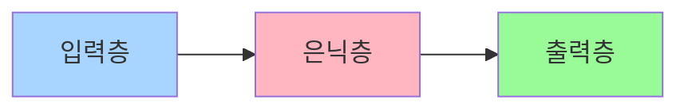
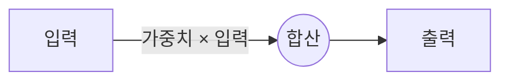

# 머신러닝 및 신경망 쉽게 이해하기 🤖

## LLM (대규모 언어 모델) 이란?

우리가 일상적으로 사용하는 ChatGPT 같은 AI 채팅 서비스의 핵심 기술입니다.

- 엄청난 양의 텍스트를 학습해서 사람처럼 대화할 수 있어요
- 주로 이런 곳에 사용됩니다:
    - ✍️ 글쓰기 도우미
    - 🌐 언어 번역
    - 📝 문서 요약
    - ❓ 질문 답변

## MLP (다층 퍼셉트론) 구조 이해하기

사람의 뇌를 본따 만든 인공 신경망의 기본 구조입니다.

마치 레고 블록처럼 여러 층을 쌓아서 복잡한 패턴을 학습할 수 있어요.

## 활성화 함수: 신경망의 의사결정 도구

활성화 함수는 신경망이 "생각"하는 방식을 결정합니다.

| 함수 이름 | 특징 | 주요 용도 |
| --- | --- | --- |
| 시그모이드 | 0~1 사이 값 | 예/아니오 결정 |
| ReLU | 음수는 0으로 | 일반적인 학습 |
| 소프트맥스 | 확률 형태 | 여러 선택지 중 결정 |

## 가중치와 가중합: 신경망의 학습 방식

각 연결선마다 중요도(가중치)가 있어서, 이를 조절하며 학습합니다.

# 순환 신경망 (RNN): 기억력을 가진 신경망

이전에 본 정보를 기억하면서 새로운 정보를 처리하는 특별한 신경망입니다.

- 📚 문장을 이해할 때처럼 순서가 중요한 데이터를 처리해요
- 🔄 세 가지 주요 모델이 있습니다:
    - 기본 RNN: 간단하지만 긴 문장 처리가 어려워요
    - LSTM: 긴 문장도 잘 기억할 수 있어요
    - GRU: LSTM을 더 간단하게 만든 버전이에요

# API: 프로그램들의 소통 창구

다른 프로그램의 기능을 쉽게 가져다 쓸 수 있게 해주는 도구입니다.

<aside>
📌 API의 장단점

</aside>

### 장점 👍

- 개발 시간 절약
- 자원 효율적 사용
- 다양한 기능 확장 가능

### 단점 👎

- 수정이 어려움
- 사용료가 발생할 수 있음
- 외부 서비스 의존성