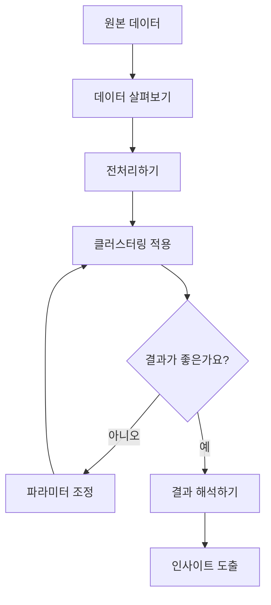

# 1. 데이터 전처리 및 클러스터링 기법

## 데이터 클러스터링이란 무엇인가요?

- 비슷한 특성을 가진 데이터들을 그룹으로 묶는 작업입니다
- 예시) 고객들의 구매 패턴을 분석하여 비슷한 성향의 고객들을 그룹화하기

## 데이터 전처리가 왜 중요한가요?

- 깨끗한 데이터가 정확한 분석 결과를 만듭니다
- 실제 데이터는 대부분 누락값, 이상값 등이 있어 정제가 필요합니다

### 데이터 전처리 상세 과정

**전처리 단계 자세히 알아보기**

1. 불필요한 열 제거하기

    - 분석과 관계없는 데이터는 과감히 삭제
    - 예: 고객 분석시 주문번호는 불필요할 수 있음
2. 성별 데이터 숫자로 변환하기

    - 컴퓨터가 이해할 수 있는 형태로 변환
    - 예: 남성=0, 여성=1로 변환
3. 수치 데이터 크기 맞추기

    - 나이(0~100)와 소득(0~수억)의 단위 차이 조정
    - 모든 특성이 동등하게 반영되도록 조정

<aside>
**📊 데이터 크기 조정 방법 비교**
| 방법 | 설명 | 사용하면 좋은 경우 |
|------|------|-------------------|
| 표준화 | 평균=0, 표준편차=1로 조정 | 정규분포와 비슷한 데이터 |
| 정규화 | 모든 값을 0~1 사이로 조정 | 이상치가 적은 데이터 |

</aside>

## 2. 클러스터링 기법 쉽게 이해하기

## 자주 묻는 질문

- 어떤 클러스터링 방법을 선택해야 할까요?
    - 데이터의 특성과 목적에 따라 다릅니다
    - 아래 표를 참고하여 선택하세요
- 클러스터 수는 어떻게 정하나요?
    - 데이터를 보면서 시각적으로 판단할 수 있습니다
    - 수학적인 방법으로도 최적값을 찾을 수 있습니다

<aside>
**🔍 클러스터링 방법 상세 비교**
| 방법 | 특징 | 장점 | 단점 |
|------|------|------|------|
| K-Means | 원 모양으로 그룹화 | 빠르고 이해하기 쉬움 | 원형 아닌 모양에 취약 |
| 계층적 군집화 | 트리처럼 구조화 | 시각적으로 보기 좋음 | 데이터 많으면 느림 |
| DBSCAN | 밀도 기반 그룹화 | 복잡한 모양도 가능 | 파라미터 설정 어려움 |
| GMM | 확률 기반 그룹화 | 유연한 그룹화 가능 | 계산이 복잡함 |

</aside>

**🎯 최적의 그룹 수를 찾는 방법**

1. 엘보우 방법으로 찾기

    - 그래프가 팔꿈치 모양으로 꺾이는 지점이 최적
    - 예: 그룹 수가 3일 때 꺾인다면 3개가 최적
2. 실루엣 분석으로 확인하기

    - 각 그룹이 얼마나 잘 구분되는지 점수로 확인
    - 1에 가까울수록 그룹이 잘 나뉜 것


```

# 3. 클러스터링 결과 이해하기

## 각 그룹의 특징은 어떻게 파악하나요?

- 그룹별 평균값 비교하기
- 시각화로 패턴 찾기

## 차원 축소란?

- 복잡한 데이터를 간단하게 만들기
- PCA로 중요한 특성만 추출하기

> 📈 **PCA(주성분 분석) 쉽게 이해하기**
> 
> PCA1: 데이터에서 가장 중요한 특성을 찾아내는 첫 번째 축
> 예시) 키와 몸무게 데이터에서 '체격' 이라는 새로운 특성 발견
>
> PCA2: 두 번째로 중요한 특성을 나타내는 축
> 예시) '체형' 같은 또 다른 중요 특성 발견

# 4. 실전: 구매 예측 모델 만들기

## 예측 모델 만들기

- 데이터 나누기 (학습용/테스트용)
- 여러 모델 비교하기
- 최적의 모델 선택하기

## 모델 성능 평가하기

- 정확도: 전체 예측 중 맞춘 비율
- ROC-AUC: 불균형 데이터에서도 정확한 평가

> 📊 **평가 지표 자세히 알아보기**
> 
> 1. 정확도 (Accuracy)
>    - 장점: 이해하기 쉽고 직관적
>    - 단점: 데이터가 불균형할 때 부적절할 수 있음
>
> 2. ROC-AUC
>    - 장점: 불균형 데이터에서도 신뢰성 높음
>    - 단점: 계산이 복잡하고 설명하기 어려움